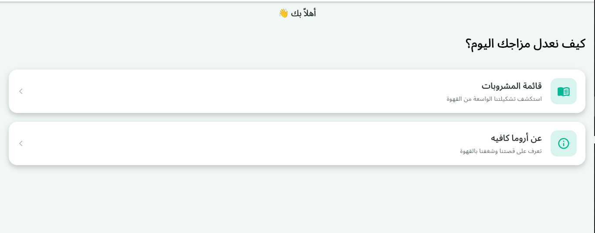
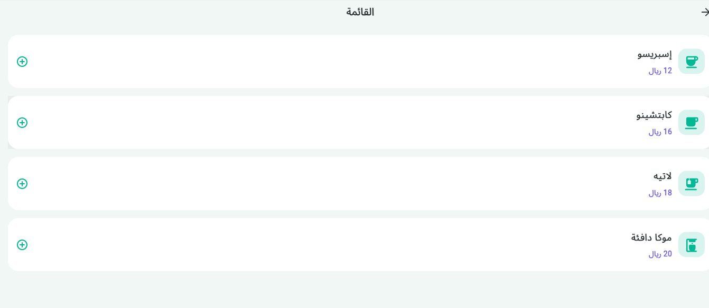
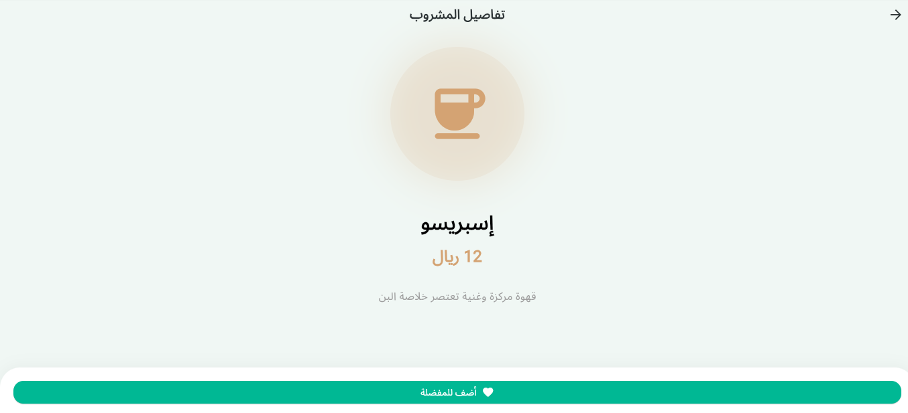

# تطبيق أروما كافيه - Aroma Cafe 
.

## لقطات من التطبيق (Screenshots)

### 1. الشاشة الرئيسية (Home Screen)
.

### 2. قائمة المشروبات (Menu Screen)
.

### 3. تفاصيل المشروب (Detail Screen)
.

### 4. عن أروما (About Screen)
.

## المميزات التقنية:
- **التنقل (Basic Stack Navigation):** استخدام `Navigator.push` و `Navigator.pop`.
- **تمرير البيانات (Passing Data):** إرسال كائنات (Objects) من شاشة إلى أخرى.
- **إرجاع النتائج (Returning Results):** استلام نص النتيجة من شاشة التفاصيل وإظهاره عبر `SnackBar`.
  

